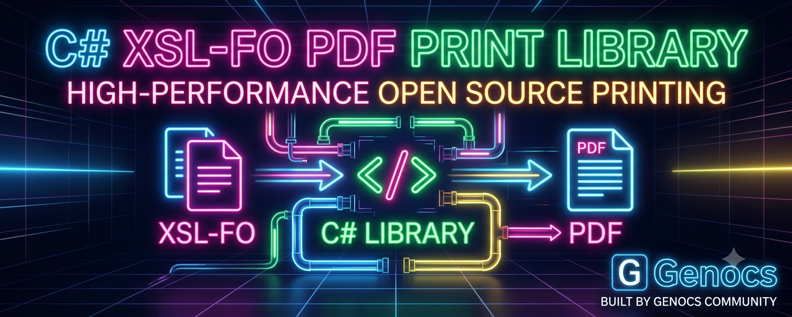

# Genocs Fonet

Genocs Fonet is a .NET port of **Fonet**, an XSL-FO formatter that produces PDF. The original library depended on **Windows GDI** for fonts, metrics, glyph mapping, and image decoding.
This port targets **modern .NET without Windows graphics dependencies**, using SkiaSharp for cross-platform font and image handling.



> **Status:** Work in progress
> 
>  Suitable for experimentation and evaluation; not recommended for production yet (FO coverage gaps remain). 
>
> See [Status](#status) and [docs/](./docs/).

## Solution layout

| Project | Role |
|---------|------|
| `src/Fonet` | Core engine: XSL-FO → PDF |
| `src/Fonet.XsltTransformer` | Application layer: XML + XSLT → XSL-FO → PDF |
| `src/tests/Fonet.Tests` | Unit and FO fixture tests |
| `src/WebApi` | Sample minimal API that builds PDFs via `XslFoPdfService` |

Targets: **.NET 8 / 9 / 10**.

---

## Package roles

### `Genocs.Fonet` — XSL-FO → PDF

Use this when you already have (or can produce) XSL-FO and only need rendering:

- Parses FO input (`FonetDriver`)
- Lays out and renders PDF (`PdfRenderer`)
- Resolves fonts (system + private) and embeds images

```csharp
using Genocs.Fonet;
using Genocs.Fonet.Render.Pdf;

var driver = FonetDriver.Make();
driver.Options = new PdfRendererOptions();
driver.Options.AddPrivateFont(new FileInfo("fonts/Nunito-Regular.ttf"));
driver.Render(foXmlDocument, outputStream);
```

### `Genocs.Fonet.XsltTransformer` — XML → XSLT → FO → PDF

Use this when PDF generation is driven by **document models**, **XSLT templates**, and optional **localization XML**. It sits on top of `Genocs.Fonet` and owns the end-to-end print pipeline used by the WebApi sample.

**Responsibilities**

| Concern | What it does |
|---------|----------------|
| Document contract | `IPrintableDocument` / `IPayload` — models expose XML via `ToXml()` |
| Template loading | `ResourceManager` loads `.fo` XSLT stylesheets (and culture variants) |
| Localization | Optional resources XML merged into the transform input |
| XSLT transform | `XmlTransformationManager` wraps `XslCompiledTransform` (XML + resources → XSL-FO) |
| PDF rendering | `PdfPrinterDriver` configures `FonetDriver`, registers private fonts, writes PDF streams/files |
| Orchestration | `XslFoPdfService` (`IPdfWriterService`) runs the full pipeline in one call |
| Extras | Base64 `data:image/...` handling for `fo:external-graphic`; XSLT extension helpers |

**Not responsible for**

- FO layout or PDF internals (delegated to `Genocs.Fonet`)
- Hosting, HTTP, or template storage (WebApi / your app)

**Pipeline**

```text
IPrintableDocument.ToXml()
        + optional localization XML
        ↓
   XSLT template (*.fo)
        ↓
   XSL-FO XmlDocument
        ↓
   Genocs.Fonet (PdfPrinterDriver)
        ↓
   PDF stream / file
```

**Example**

```csharp
using Genocs.Fonet.XsltTransformer.Transformers;
using Microsoft.Extensions.Logging.Abstractions;

IPrintableDocument document = /* your model */;
var pdfService = new XslFoPdfService(NullLogger<XslFoPdfService>.Instance);

using Stream pdf = pdfService.Print(
    document,
    templateName: "invoice.fo",
    resourcesName: "resources.xml",
    fontsDirectory: "fonts",
    countryId: "IT");
```

If you already have an XSL-FO `XmlDocument`, skip XSLT and call `PdfPrinterDriver` directly:

```csharp
PdfPrinterDriver.MakePdf(xslFoDocument, "output.pdf", fontDir: "fonts");
// or
using Stream pdf = PdfPrinterDriver.MakePdfStream(xslFoDocument, fontDir: "fonts");
```

**When to choose which package**

| You have… | Use |
|-----------|-----|
| Ready XSL-FO | `Genocs.Fonet` alone |
| Models + XSLT templates (+ optional localization) | `Genocs.Fonet.XsltTransformer` |

More detail: [`src/XsltTransformer/README_NUGET.md`](./src/XsltTransformer/README_NUGET.md).

---

## Cross-platform font & image stack

Windows GDI dependencies are replaced with **SkiaSharp**:

- **Images** — format detection and pixels via `SKCodec` / `SKBitmap` (`src/Fonet/Image/ApocImage.cs`)
- **Fonts** — enumeration and typefaces via `SKFontManager` / `SKTypeface` (GDI-compatible layer under `src/Fonet/Pdf/Gdi/`)
- **Private fonts** — `PdfRendererOptions.AddPrivateFont(...)` registers files into the Skia-backed font manager

Then reference the family in FO:

```xml
<fo:block font-family="Nunito" font-size="16pt">
  Hello Nunito
</fo:block>
```

Sample fonts and FO templates live under `src/tests/Fonet.Tests/fonts` and `.../templates`.

On Linux/Docker, reference `SkiaSharp.NativeAssets.Linux` on the executable project if `libSkiaSharp.so` is missing at runtime.

---

## Build / test

```powershell
dotnet build fonet.slnx -c Debug
dotnet test fonet.slnx -c Debug
```

## PDF Web API

`src/WebApi` is a minimal API that builds PDFs through `XslFoPdfService` (same pipeline as above). Templates, fonts, and assets load from configurable paths (Docker volumes in compose).

```bash
./scripts/run-on-docker.sh
# POST http://localhost:5080/api/pdf  — see src/WebApi/README.md
```

---

## Status

| Area | Status |
|------|--------|
| Build | ✅ Compiles on `net8.0`, `net9.0`, `net10.0` |
| CI | ✅ GitHub Actions (build, test, pack) |
| Font pipeline | ✅ Glyph mapping, subsetting, metrics (Phase 1) |
| Quality | ✅ Image spans, encoding, namespaces (Phase 2) |
| FO completeness | 🔄 Tier 1 batch done; ~87 properties still stubbed (Phase 3) |
| Tests | ✅ 22 tests with PDF structure validation on net8/9/10 |
| Production use | ⚠️ Not recommended yet — FO coverage gaps; CJK needs validation |

Migration status, known issues, and roadmap: [docs/](./docs/).

### Known limitations

Tracked in [docs/known-issues.md](./docs/known-issues.md) and [docs/migration-plan.md](./docs/migration-plan.md):

1. **~87 unimplemented FO properties** — logged and ignored during layout
2. **11 unimplemented FO elements** — parse but produce no layout
3. **Side-float layout** — `fo:float` renders in flow; float/clear/z-index do not affect layout
4. **System font discovery** — filesystem scan with filename matching; can be imprecise on Linux/macOS
5. **CJK / complex scripts** — not validated with fixture tests yet
6. **PDF encryption** — legacy RC4 only

### Migration progress

- **Phase 0 (stabilize)** — ✅ complete
- **Phase 1 (font pipeline)** — ✅ complete
- **Phase 2 (quality)** — ✅ complete
- **Phase 3 (FO completeness)** — 🔄 in progress (Tier 1 properties and table captions done; side-float layout deferred)
